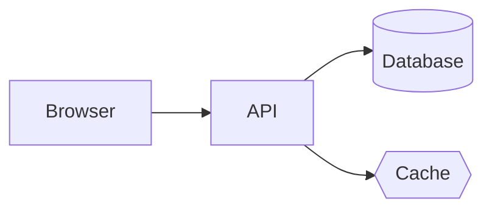
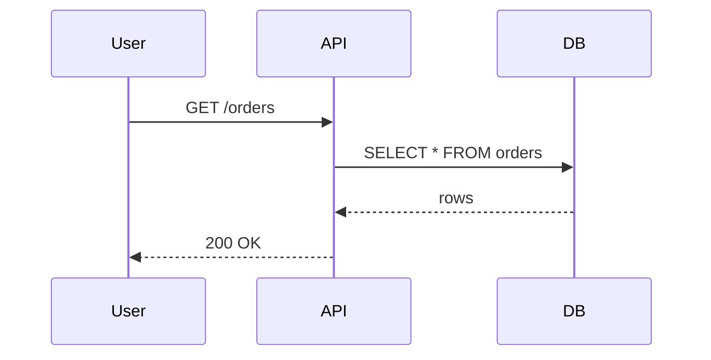
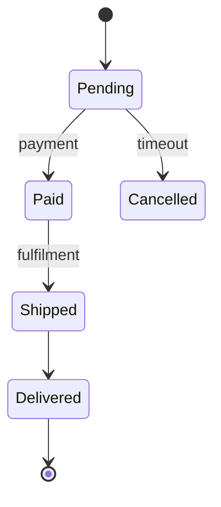

# markdown-reader

A terminal markdown reader with **live-preview editing**, inline Mermaid diagrams, and LaTeX math — built for browsing whole documentation repositories.

## Architecture

## Request flow

## Order lifecycle

## Math

Inline: $E = mc^2$ — Einstein's mass-energy equivalence.

Display:

$$
\sum_{i=1}^{n} i = \frac{n(n+1)}{2}
$$

## Tasks

- [x] Ship hybrid live-preview editing
- [x] 10 supported Mermaid diagram types
- [x] LaTeX math rendering as Unicode
- [x] HTML export, link validator, outline navigator
- [ ] Record this demo GIF

## Comparison

| Feature           | markdown-reader | treemd | glow | bat |
|-------------------|-----------------|--------|------|-----|
| Mermaid (inline)  | Yes             | No     | No   | No  |
| LaTeX math        | Yes             | No     | No   | No  |
| Hybrid editing    | Yes             | No     | No   | No  |
| Tabs + sessions   | Yes             | No     | No   | No  |
| HTML export       | Yes             | No     | No   | No  |
| Link validator    | Yes             | No     | No   | No  |
| 8 themes          | Yes             | Yes    | No   | No  |
