# Mermaid Diagram Gallery

Every Mermaid feature `markdown-reader` (via the
[`mermaid-text`](https://crates.io/crates/mermaid-text) crate) can render
in your terminal, with one runnable example per feature.

Open this file in `markdown-reader` to see the diagrams rendered live.
You can also paste any code block into a `.mmd` file and run
`mermaid-text path/to/file.mmd` to see the same output on the command
line.

---

## Flowcharts

### Basic flowchart with directions

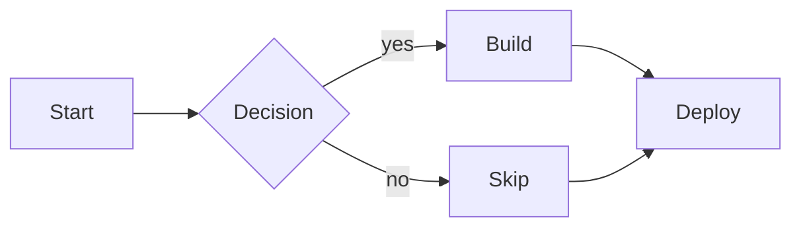

Directions are `LR` (left→right), `RL`, `TB` (top→bottom), and `BT`.

### Subgraphs

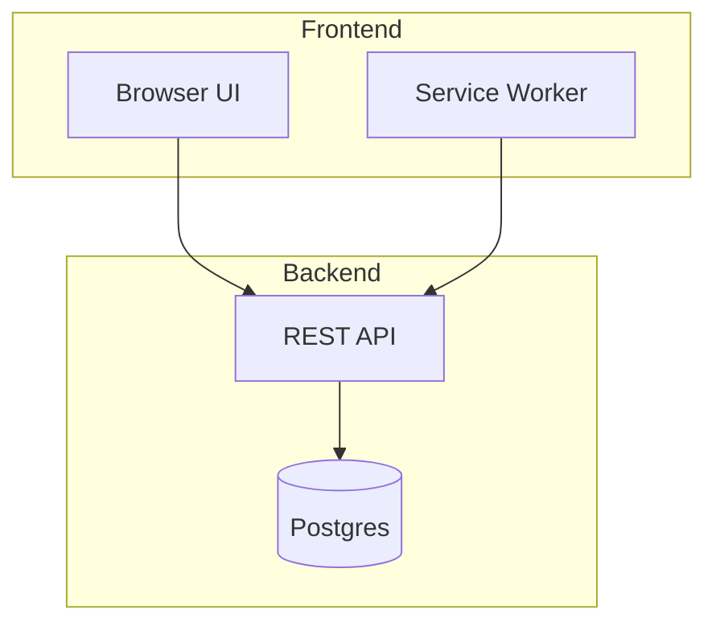

### Edge styles and labels

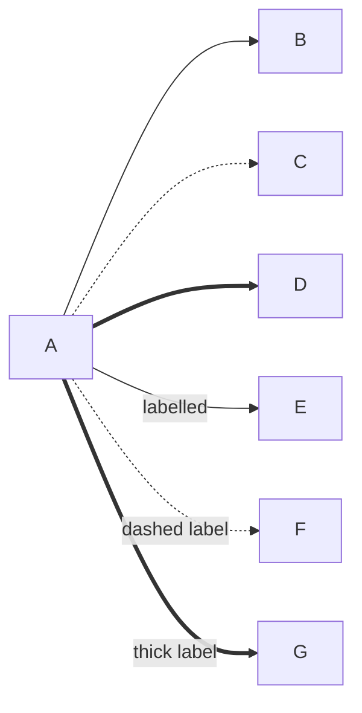

### Colors via classDef + class

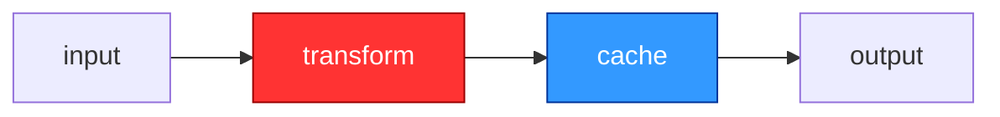

`mermaid-text` honours these colours when rendered with `--color`
(24-bit ANSI). The TUI viewer enables it automatically.

---

## State diagrams

### Basic state machine

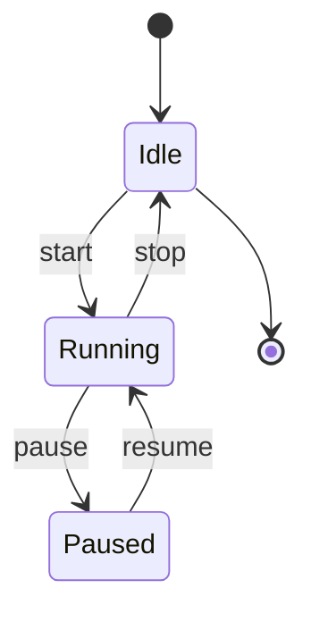

### Composite states (nested)

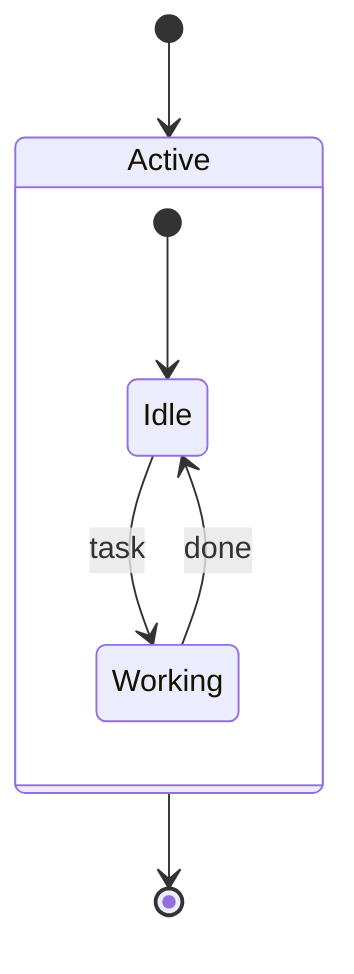

### Choice / fork / join shape modifiers

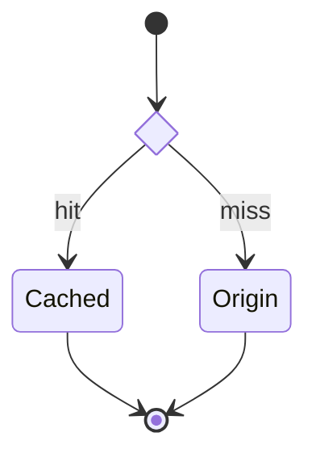

### Notes anchored to a state

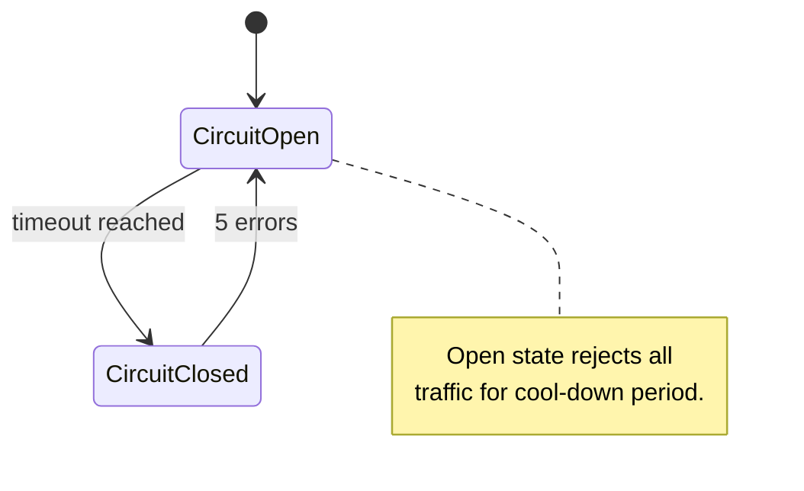

---

## Sequence diagrams

### Minimal call/reply

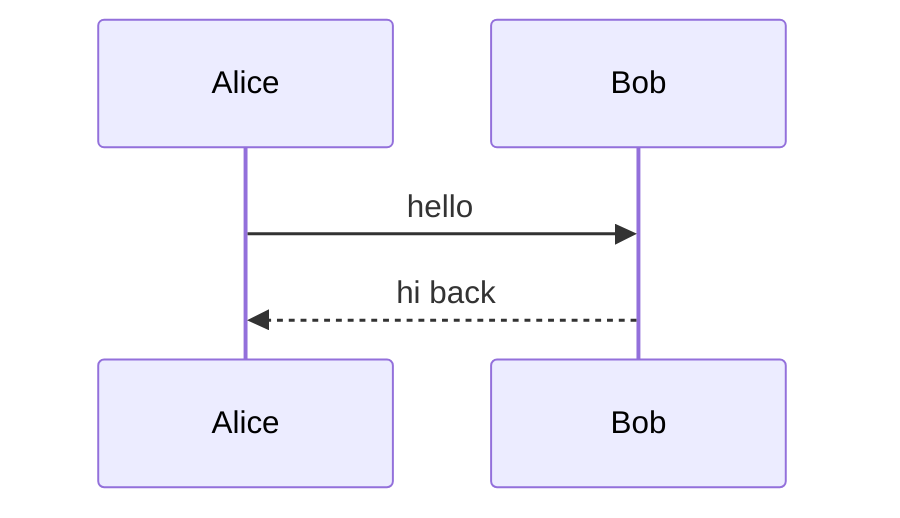

`->>` = solid arrow with arrowhead, `-->>` = dashed (typical for replies).
Plain `->` and `-->` are no-arrowhead variants.

### Participants and aliases

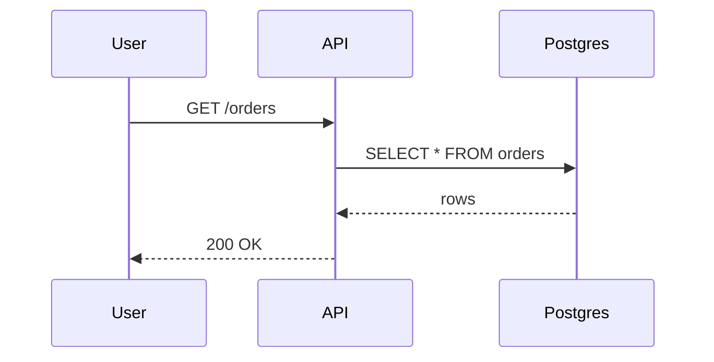

### Autonumber

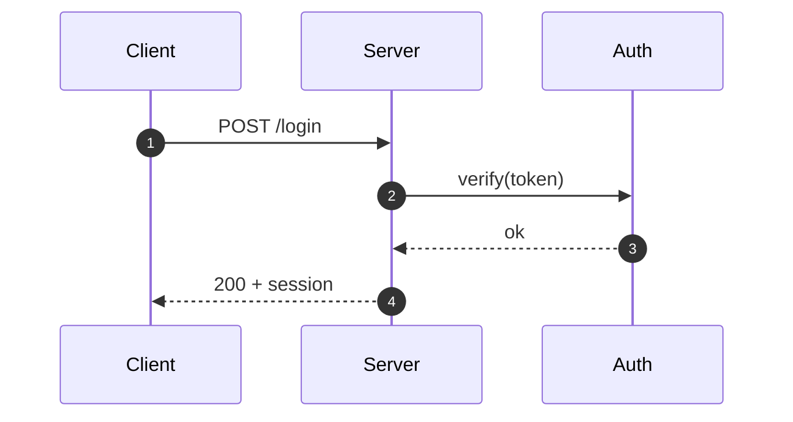

`autonumber 100` re-bases the counter; `autonumber off` halts numbering
mid-diagram.

### Notes (single anchor and spanning)

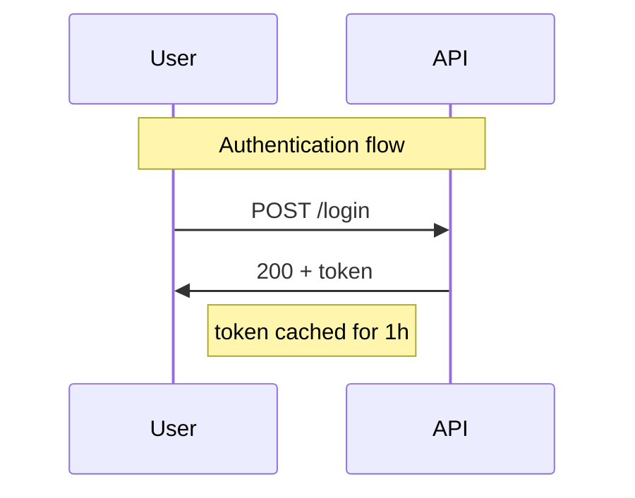

`note left of X`, `note right of X`, `note over X`, and
`note over X,Y` (spanning two participants) are supported. Use ` ` or
` ` for multi-line note text.

### Activation bars

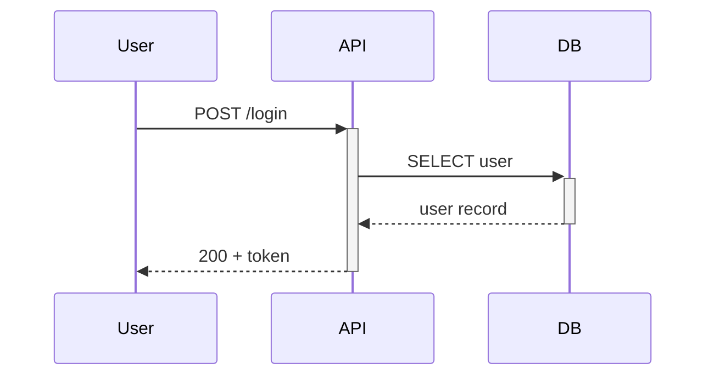

`+` on the message target activates the receiver; `-` deactivates the
sender. Explicit `activate X` / `deactivate X` directives also work,
including arbitrary nesting on the same participant.

### Block statements

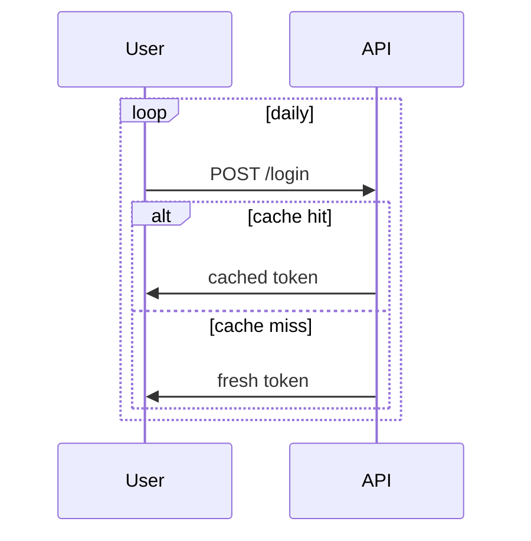

Supported blocks: `loop`, `alt`/`else`, `opt`, `par`/`and`,
`critical`/`option`, `break`. Nested blocks inset by one cell per
nesting level so they read distinctly.

### Everything together

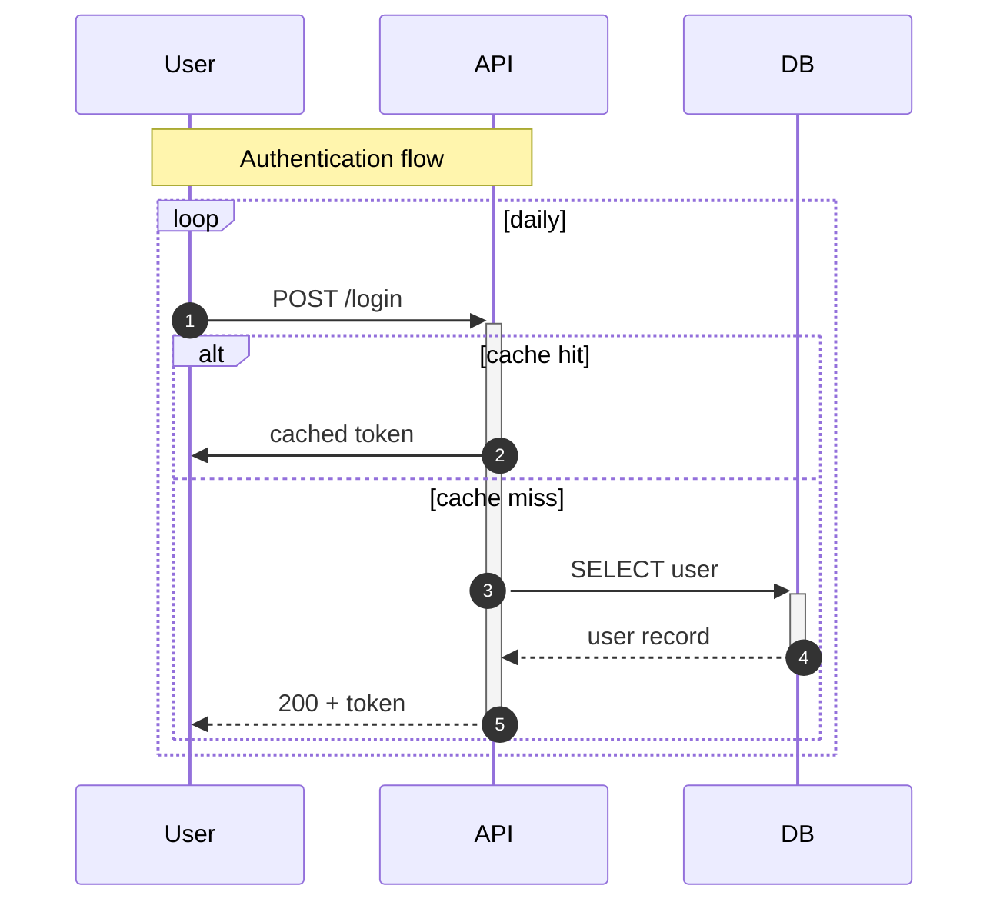

All four sequence-polish features compose: autonumber + notes +
activation bars + block statements in a single diagram.

---

## Pie charts

### Basic pie

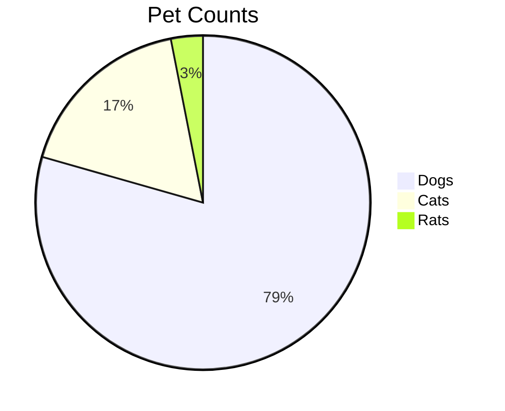

Renders as a horizontal bar chart in monospace text — far more legible
than any ASCII pie attempt.

### With raw values (`showData`)

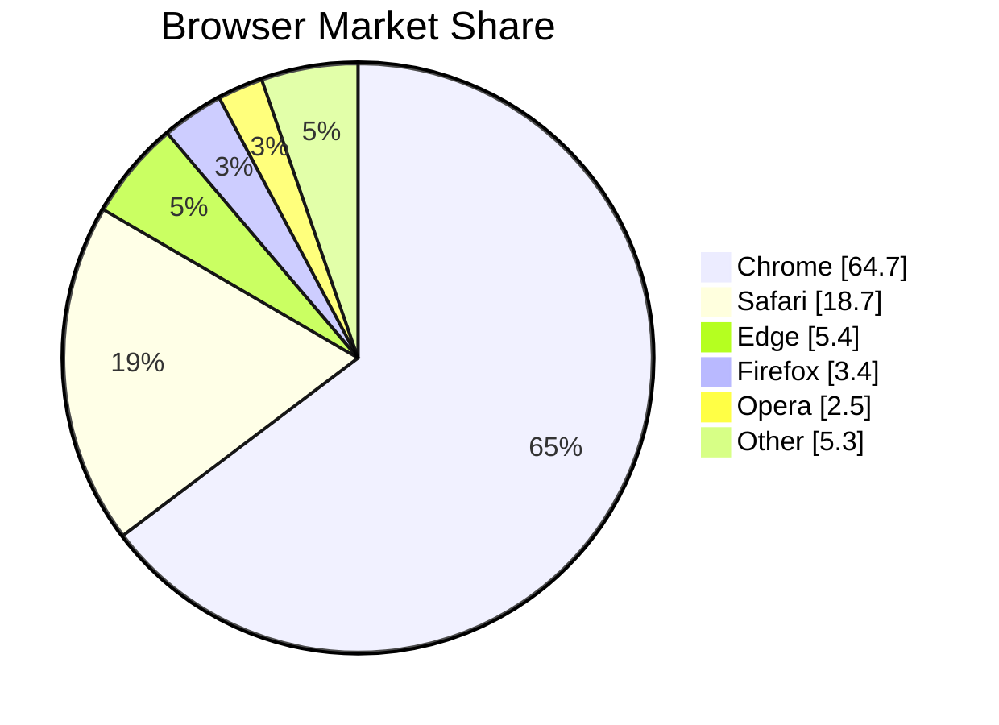

The `showData` keyword adds a `(value)` column next to each slice's
percentage. Decimal values are supported.

---

## Not yet supported

These Mermaid diagram types fall back to showing source text rather
than rendering:

- `gantt`
- `journey`
- `erDiagram`
- `classDiagram`
- `rect …` colour-highlight blocks inside sequence diagrams (the
  block grammar itself is supported — only the colour form is
  deferred)
- Slice colours in pie charts (rendered monochrome in v1)

See the [ROADMAP](../ROADMAP.md) for what's planned next, and file
issues at <https://github.com/leboiko/markdown-reader/issues> if you
hit something specific.
