# Mermaid Diagram Gallery

Every Mermaid feature `markdown-reader` (via the
[`mermaid-text`](https://crates.io/crates/mermaid-text) crate) can render
in your terminal, with one runnable example per feature.

Open this file in `markdown-reader` to see the diagrams rendered live.
You can also paste any code block into a `.mmd` file and run
`mermaid-text path/to/file.mmd` to see the same output on the command
line.

## What's covered

- **Flowcharts** (`graph` / `flowchart`) with subgraphs, edge styles,
  `classDef` colours, and long-edge waypoint routing for clean channels
  through complex graphs.
- **State diagrams** with composite (nested) states, `<<choice>>` /
  `<<fork>>` / `<<join>>` shape modifiers, anchored notes, and
  `classDef` colour styling.
- **Sequence diagrams** — feature-complete: `autonumber`, notes
  (single + multi-anchor + `<br>` line breaks), activation bars
  (explicit + inline `+`/`-`), block statements (`loop`/`alt`/`opt`/
  `par`/`critical`/`break` with arbitrary nesting), and bracketed
  lifelines (boxes top AND bottom).
- **Entity-relationship diagrams** (`erDiagram`) with attribute
  tables inside each entity box, single-character cardinality glyphs
  at endpoints (`1`, `?`, `+`, `*`), and identifying vs
  non-identifying line styles.
- **Pie charts** rendered as horizontal bar charts (more legible in
  monospace than any ASCII pie attempt).
- **Gantt charts** (`gantt`) rendered as Unicode horizontal bar charts
  with a tick-labelled date axis, section headings, `█`/`░` task bars,
  and `[start → end, Nd]` annotations. Supports explicit dates, `after
  <id>` dependencies, and chained implicit-start tasks. Phase 1
  limitations: status tags (`done`, `active`, `crit`, `milestone`) and
  `excludes`/`includes` are silently ignored.
- **Timeline diagrams** (`timeline`) rendered as a vertical
  bullet-on-a-wire flow. Each section has a `── Name ─────` header;
  each time period gets a `●──` bullet; additional events for the same
  period hang below with `└──` connectors. Phase 1 limitations: `&`
  relationship links and custom colour themes are silently ignored.
- **Git graph diagrams** (`gitGraph`) rendered as a lane-based commit
  graph with one branch per vertical column and time flowing
  top-to-bottom. Glyphs: `*` normal commit, `M` merge commit, `C`
  cherry-pick; `╭╮╰╯─` for fork and merge arcs; `│` for lane
  continuation. Commit ids and optional `[tag]` annotations appear to
  the right. Branch names are printed at the bottom of each lane.
  Phase 1 limitations: direction modifiers (`LR`/`TB`), extended
  commit types (`REVERSE`/`HIGHLIGHT`), and custom themes are silently
  ignored.
- **Mindmap diagrams** (`mindmap`) rendered as a vertical Unicode tree.
  The root node is displayed in a `╭─…─╮` rounded box at the top with a
  trunk `│` connector leading to child nodes. Non-last children use
  `├──`; last children use `└──`; continuation pipes `│   ` track
  open branches at each nesting level. Phase 1 limitations: all 6
  Mermaid node shapes (default, rounded, circle, bang, cloud, hexagon)
  are normalised to plain text; `::icon(...)` directives are silently
  ignored; custom colour themes have no effect.

Recent rendering improvements: arrow tips merge into destination box
borders (`┌─▾─┐` instead of floating `▾` above), edge labels never
puncture node corners or subgraph borders, and block-statement frames
use a Mermaid-style two-tag style (`╔═[alt]══[cache hit]══╗`).

---

## Flowcharts

### Basic flowchart with directions

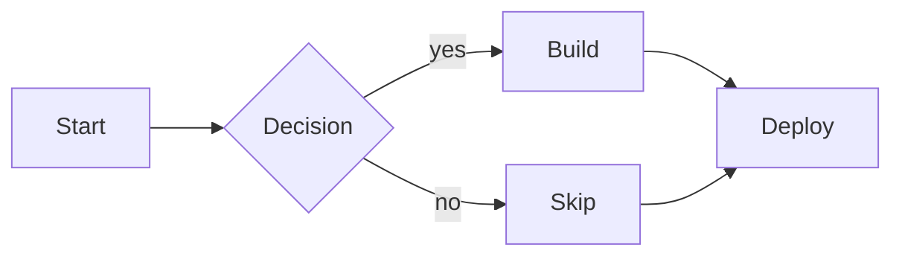

Directions are `LR` (left→right), `RL`, `TB` (top→bottom), and `BT`.

### Subgraphs

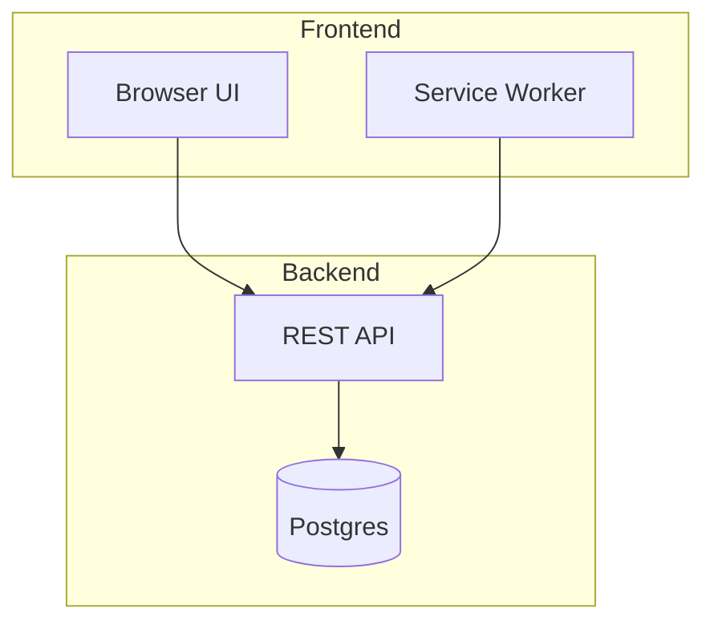

### Edge styles and labels

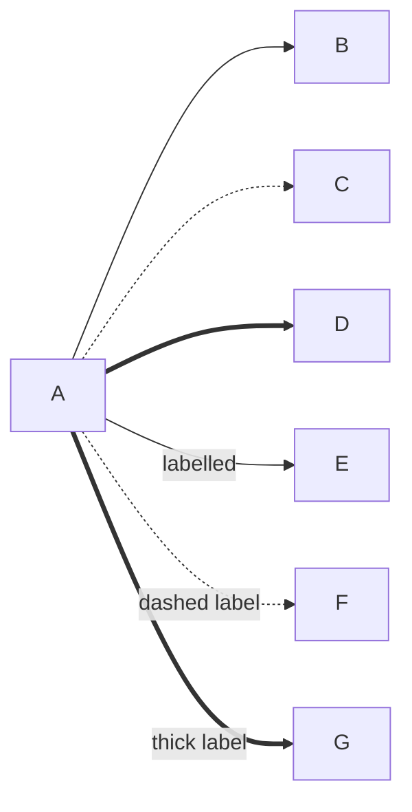

### Node shape showcase

All 13 supported node shapes in one diagram. Each shape has a distinct
visual treatment so they can be told apart at a glance:

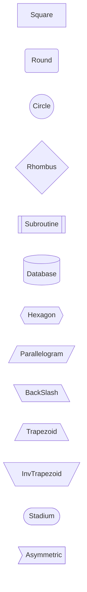

Expected terminal output (0.25.0+):

```
┌────────┐     ╭───────╮     ╭──────────╮     ╱─────────╲
│ Square │     │ Round │     (  Circle  )     │ Rhombus │
└────────┘     ╰───────╯     ╰──────────╯     ╲─────────╱

┌──────────────┐     ╭──────────╮     ╱───────────╲
││ Subroutine ││     │ ──────── │     <  Hexagon  >
└──────────────┘     │ Database │     ╲───────────╱
                     ╰──────────╯

╱─────────────────╱     ╲─────────────╲     ╱─────────────╲
│  Parallelogram  │     │  BackSlash  │     │  Trapezoid  │
╱─────────────────╱     ╲─────────────╲     └─────────────┘

╲────────────────╱     ╭───────────╮     ┌──────────────┐
│  InvTrapezoid  │     (  Stadium  )     │  Asymmetric  ⟩
└────────────────┘     ╰───────────╯     └──────────────┘
```

Key shape distinctions (updated in 0.25.0):

- **Diamond** `{label}` — `╱` top-left / `╲` top-right corners, `╲` / `╱` bottom.
  Clearly distinguishes a decision node from a plain rectangle.
- **Circle** `((label))` — `(` / `)` replace the side border at the midpoint row.
  The label text is undecorated ("Circle", not "( Circle )").
- **Stadium** `([label])` — same `(` / `)` border-overwrite trick as Circle.
  The parens sit ON the border, not inside the text area.
- **Cylinder** `[(label)]` — rounded box with an interior `─` lip line below the
  top border. Suggests a barrel/database cap without a misleading divider.
- **Hexagon** `{{label}}` — `╱`/`╲` diagonal corners PLUS `<`/`>` side-point markers.
  Six visual edges approximate a true hexagon.
- **Parallelogram** `[/label/]` — `╱` at all four corners (consistent lean-right).
- **BackSlash Parallelogram** `[\label\]` — `╲` at all four corners (lean-left mirror).
- **Trapezoid** `[/label\]` — `╱` top-left, `╲` top-right, square bottom corners.
- **Inverted Trapezoid** `[\label/]` — `╲` top-left, `╱` top-right, square bottom corners.

### Colors via classDef + class

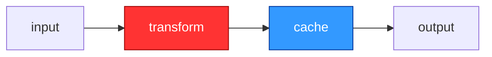

`mermaid-text` honours these colours when rendered with `--color`
(24-bit ANSI). The TUI viewer enables it automatically.

---

## State diagrams

### Basic state machine

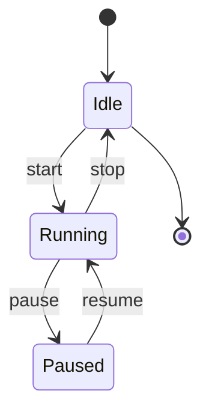

### Composite states (nested)

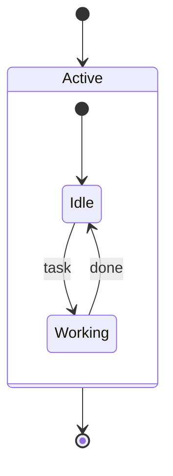

### Choice / fork / join shape modifiers

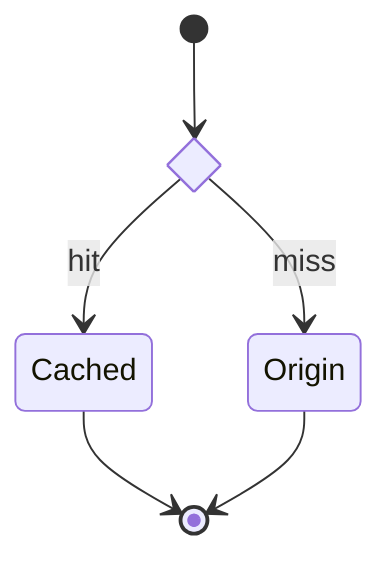

### Notes anchored to a state

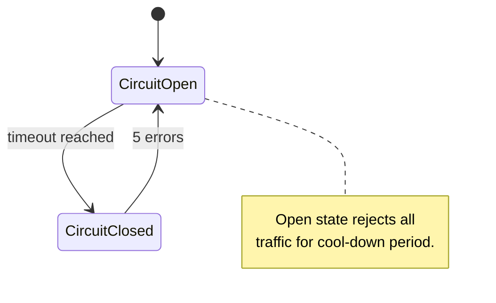

---

## Sequence diagrams

### Minimal call/reply

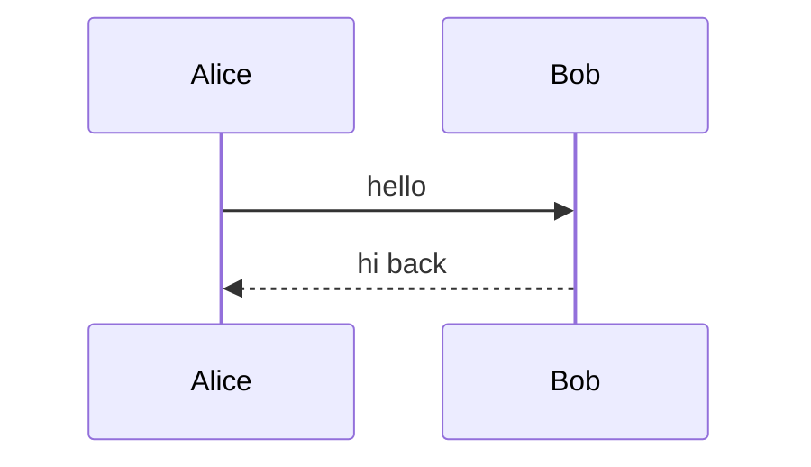

`->>` = solid arrow with arrowhead, `-->>` = dashed (typical for replies).
Plain `->` and `-->` are no-arrowhead variants.

### Participants and aliases

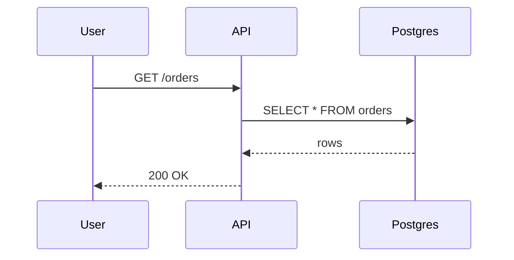

### Autonumber

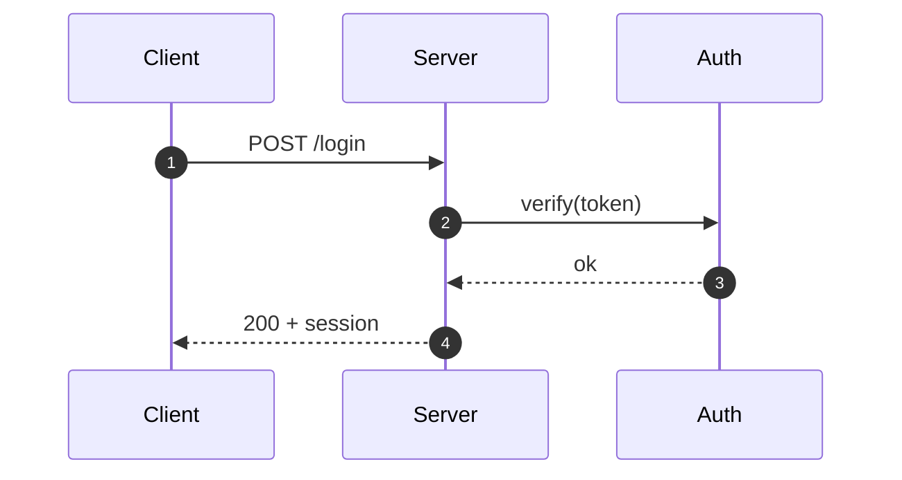

`autonumber 100` re-bases the counter; `autonumber off` halts numbering
mid-diagram.

### Notes (single anchor and spanning)

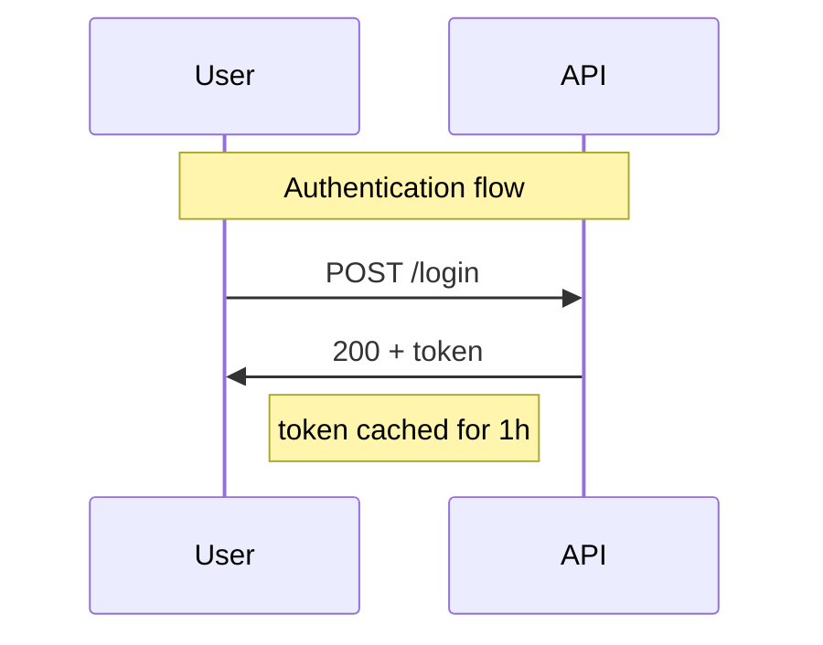

`note left of X`, `note right of X`, `note over X`, and
`note over X,Y` (spanning two participants) are supported. Use `<br>` or
`<br/>` for multi-line note text.

### Activation bars

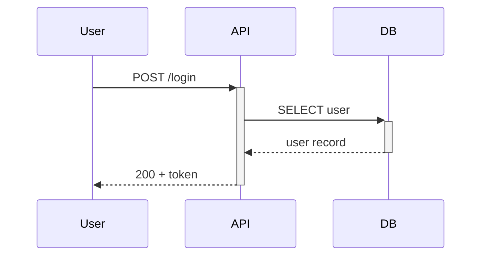

`+` on the message target activates the receiver; `-` deactivates the
sender. Explicit `activate X` / `deactivate X` directives also work,
including arbitrary nesting on the same participant.

### Block statements

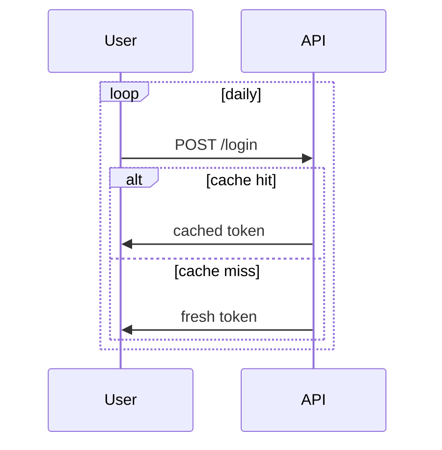

Supported blocks: `loop`, `alt`/`else`, `opt`, `par`/`and`,
`critical`/`option`, `break`. Nested blocks inset by one cell per
nesting level so they read distinctly.

### Everything together

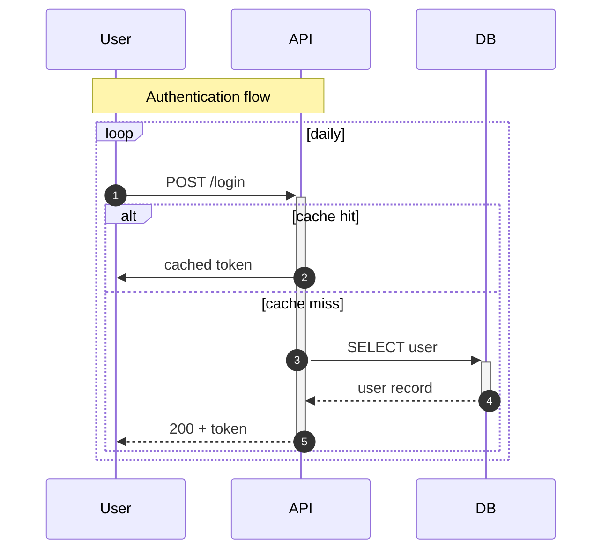

All four sequence-polish features compose: autonumber + notes +
activation bars + block statements in a single diagram.

---

## Entity-relationship diagrams

### Canonical customer/order schema

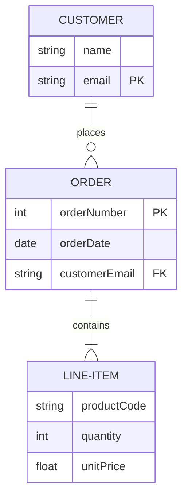

Entities render as boxes with attribute tables (type / name / keys
columns). Relationships carry single-character cardinality glyphs at
each endpoint:

- `1` — exactly one
- `?` — zero or one
- `+` — one or many
- `*` — zero or many

The connector is solid (`─`) for identifying relationships (`--` in
Mermaid) and dashed (`┄`) for non-identifying (`..`).

### Optional (non-identifying) relationship

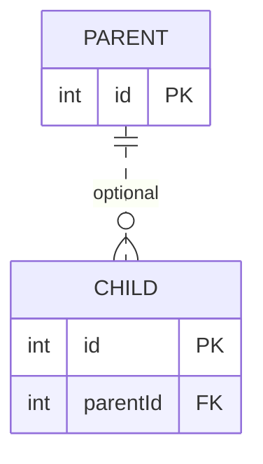

The `||..o{` connector renders as a dashed line to mark it as
non-identifying — the child could exist independently of the parent.

### Wide schema: grid layout (Phase 3)

When a diagram has more than ~5 entities (or when `max_width` is set and the
single-row layout would exceed it), the renderer wraps entities into a
`ceil(sqrt(n))`-column grid. Relationships between entities in the same row
use the existing horizontal routing; cross-row relationships route via a
vertical spine on the right margin of the canvas.

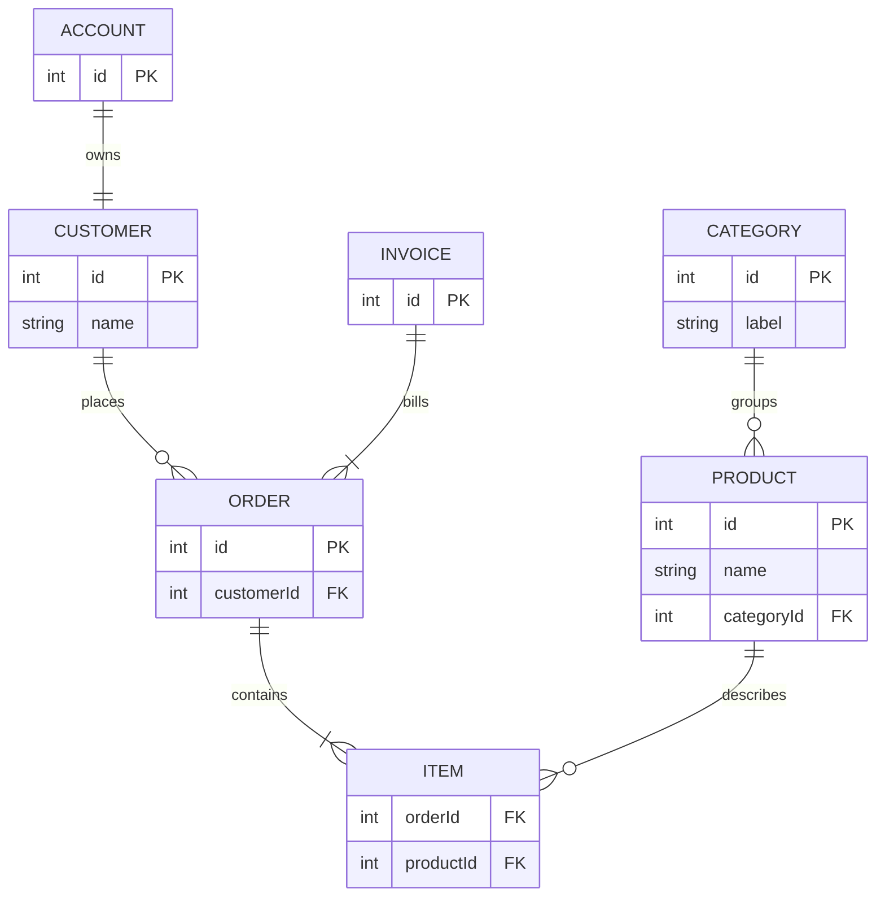

With a 40-column budget, the 7 entities above render in a 3-column grid
(ceil(sqrt(7)) = 3) with cross-row arrows routed along the right spine.
Small diagrams (≤ 5 entities, or those that fit within the budget) are
unaffected — they continue to render in a single row.

---

## Pie charts

### Basic pie

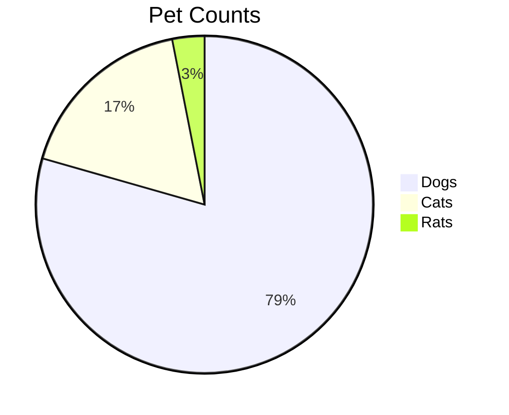

Renders as a horizontal bar chart in monospace text — far more legible
than any ASCII pie attempt.

### With raw values (`showData`)

```mermaid
pie showData title Browser Market Share
    "Chrome" : 64.7
    "Safari" : 18.7
    "Edge" : 5.4
    "Firefox" : 3.4
    "Opera" : 2.5
    "Other" : 5.3
```

The `showData` keyword adds a `(value)` column next to each slice's
percentage. Decimal values are supported.

---

---

## Gantt charts

Gantt diagrams render as horizontal bar charts, one task per row. Task bars
(`█` active, `░` empty) are scaled to fit the terminal width. A tick-labelled
date axis appears above the bars.

### Simple project schedule

```mermaid
gantt
    title Software Release v2
    dateFormat YYYY-MM-DD
    axisFormat %m-%d
    section Design
      Research       :r1, 2024-01-01, 7d
      Wireframes     :after r1, 5d
    section Development
      Backend        :b1, 2024-01-13, 14d
      Frontend       :after b1, 10d
    section QA
      Testing        :2024-02-06, 7d
```

Expected output (trimmed to 80 columns):

```text
Gantt: Software Release v2 (2024-01-01 → 2024-02-12, 43 days)

                  01-01    01-08    01-15    01-22    01-29    02-05
Design
  Research        ░███████░░░░░░░░░░░░░░░░░░░░░░░░░░░░░░░░░░░░  [01-01 → 01-07, 7d]
  Wireframes      ░░░░░░░░░░█████░░░░░░░░░░░░░░░░░░░░░░░░░░░░░  [01-08 → 01-12, 5d]

Development
  Backend         ░░░░░░░░░░░░░░░░█████████████████░░░░░░░░░░░  [01-13 → 01-26, 14d]
  Frontend        ░░░░░░░░░░░░░░░░░░░░░░░░░░░░░░░░░░░███████░░  [01-27 → 02-05, 10d]

QA
  Testing         ░░░░░░░░░░░░░░░░░░░░░░░░░░░░░░░░░░░░░░░░███░  [02-06 → 02-12, 7d]
```

### Classic Mermaid example with axisFormat %b %d

```mermaid
gantt
    title A Gantt Diagram
    dateFormat YYYY-MM-DD
    axisFormat %b %d
    section Section A
        Design        :a1, 2014-01-01, 30d
        Implementation:after a1, 20d
    section Section B
        Testing       :2014-02-15, 15d
        Deployment    :3d
```

Expected output (trimmed to 80 columns):

```text
Gantt: A Gantt Diagram (2014-01-01 → 2014-03-04, 63 days)

                  Jan 01   Jan 11    Jan 21   Jan 31    Feb 10   Feb 20    Mar

Section A
  Design          ████████████████████████████░░░░░░░░░░░░░░░░░░░░  [Jan 01 → Jan 30, 30d]
  Implementation  ░░░░░░░░░░░░░░░░░░░░░░░░░░░░░██████████████████░  [Jan 31 → Feb 19, 20d]

Section B
  Testing         ░░░░░░░░░░░░░░░░░░░░░░░░░░░░░░░░░░░░░░░░░░░██████  [Feb 15 → Mar 01, 15d]
  Deployment      ░░░░░░░░░░░░░░░░░░░░░░░░░░░░░░░░░░░░░░░░░░░░░░░██  [Mar 02 → Mar 04, 3d]
```

**Phase 1 limitations.** Status tags (`done`, `active`, `crit`, `milestone`)
are silently ignored. `excludes`/`includes` (weekend skipping) and
`tickInterval` are not implemented. Non-`YYYY-MM-DD` date formats produce a
parse error. See `mermaid-text` 0.20.0 CHANGELOG for the full list.

---

## Timeline diagrams

### Social media history (two sections, multi-event period)

```mermaid
timeline
    title History of Social Media
    section 2002-2004
        2002 : LinkedIn
        2003 : MySpace launched
        2004 : Facebook : Google goes public
    section 2005-2008
        2005 : YouTube
        2006 : Twitter
        2007 : iPhone : Tumblr
```

Expected output:

```text
Timeline: History of Social Media

── 2002-2004 ─────────────────────────────────────
  2002 ●── LinkedIn
  2003 ●── MySpace launched
  2004 ●── Facebook
       └── Google goes public

── 2005-2008 ─────────────────────────────────────
  2005 ●── YouTube
  2006 ●── Twitter
  2007 ●── iPhone
       └── Tumblr
```

### Technology milestones (implicit unnamed section)

Events that appear before any `section` keyword land in an implicit unnamed
section — no section header is rendered for those entries.

```mermaid
timeline
    title Key Technology Milestones
    1991 : World Wide Web
    1993 : Mosaic browser
    section Late 90s
        1995 : JavaScript : Java applets
        1998 : Google founded
    section 2000s
        2001 : Wikipedia
        2004 : Gmail
        2007 : iPhone
```

Expected output (the 1991–1993 events appear without a section header):

```text
Timeline: Key Technology Milestones

  1991 ●── World Wide Web
  1993 ●── Mosaic browser

── Late 90s ─────────────────────────────────────
  1995 ●── JavaScript
       └── Java applets
  1998 ●── Google founded

── 2000s ────────────────────────────────────────
  2001 ●── Wikipedia
  2004 ●── Gmail
  2007 ●── iPhone
```

**Phase 1 limitations.** `&` relationship links between events are treated
as literal text. Custom colour themes are silently ignored.

---

## Git graph diagrams

A `gitGraph` diagram shows a commit history across one or more branches as a
lane-based text diagram. Time flows top-to-bottom; each branch occupies a
vertical column.

### Example 1 — main branch with a feature branch and merge

```mermaid
gitGraph
    commit
    commit id: "second"
    branch develop
    checkout develop
    commit
    commit id: "feature-x"
    checkout main
    merge develop
    commit tag: "v1.0"
```

Expected text-mode output:

```
*    c0
*    second
╭ ╮
│ *  c2
│ *  feature-x
╰ ╯
M │  c4
* │  c5 [v1.0]
main develop
```

### Example 2 — cherry-pick commit

```mermaid
gitGraph
    commit id: "init"
    branch hotfix
    checkout hotfix
    commit id: "patch"
    checkout main
    cherry-pick id: "patch"
    commit tag: "v1.1"
```

Expected text-mode output:

```
*    init
╭ ╮
│ *  patch
╰ ╯
C │  c3
* │  c4 [v1.1]
main hotfix
```

**Phase 1 limitations.** `gitGraph LR` direction modifiers are silently
ignored. Extended commit types (`REVERSE`, `HIGHLIGHT`) and `commit message:`
are silently ignored. Custom themes have no effect. Branch lanes are ordered
strictly by creation order with no crossing minimisation.

---

## Mindmap diagrams

A `mindmap` diagram is an indent-based hierarchical outline. The first node
after the `mindmap` keyword is the root; deeper indentation creates children.
The root is rendered in a rounded box at the top; the rest of the tree hangs
below it using standard tree-drawing connectors.

**Example 1 — Canonical Mermaid mindmap:**

```mermaid
mindmap
  root((mindmap))
    Origins
      Long history
      ::icon(fa fa-book)
      Popularisation
        British popular psychology author Tony Buzan
    Research
      On effectiveness and features
      On Automatic creation
        Uses
          Creative techniques
          Strategic planning
          Argument mapping
    Tools
      Pen and paper
      Mermaid
```

Expected rendered output:

```text
╭─────────╮
│ mindmap │
╰────┬────╯
     │
├── Origins
│   ├── Long history
│   └── Popularisation
│       └── British popular psychology author Tony Buzan
├── Research
│   ├── On effectiveness and features
│   └── On Automatic creation
│       └── Uses
│           ├── Creative techniques
│           ├── Strategic planning
│           └── Argument mapping
└── Tools
    ├── Pen and paper
    └── Mermaid
```

**Example 2 — Software architecture decision:**

```mermaid
mindmap
  root((Decision))
    Option A
      Pros
        Fast to implement
        Low cost
      Cons
        Hard to scale
    Option B
      Pros
        Highly scalable
        Well documented
      Cons
        Higher upfront effort
    Recommendation
      Option B for long-term growth
```

Expected rendered output:

```text
╭──────────╮
│ Decision │
╰─────┬────╯
      │
├── Option A
│   ├── Pros
│   │   ├── Fast to implement
│   │   └── Low cost
│   └── Cons
│       └── Hard to scale
├── Option B
│   ├── Pros
│   │   ├── Highly scalable
│   │   └── Well documented
│   └── Cons
│       └── Higher upfront effort
└── Recommendation
    └── Option B for long-term growth
```

**Phase 1 limitations.** All 6 Mermaid node shapes (`((circle))`, `(rounded)`,
`{{hexagon}}`, `))bang((`, `)cloud(`, `[rectangle]`) are stripped to their inner
text — the rendered tree does not visually distinguish shapes. `::icon(...)` icon
directives are silently ignored. Custom colour themes have no effect.

---

## Not yet supported

These Mermaid diagram types fall back to showing source text rather
than rendering:

- `xychart` — lower priority; may land if a real use case shows up.
- `rect <colour>` colour-highlight blocks inside sequence diagrams
  (the block grammar itself is supported — only the colour form is
  deferred; Mermaid's grammar is hard to express without bigger
  changes to our colour system).
- Slice colours in pie charts (rendered monochrome in v1; the bar
  chart approach is so legible in monospace that colours haven't
  been requested yet).

File issues at <https://github.com/leboiko/markdown-reader/issues>
if you hit something specific. Quality bugs (rendering glitches,
edge-case crashes) get the fastest turnaround.
