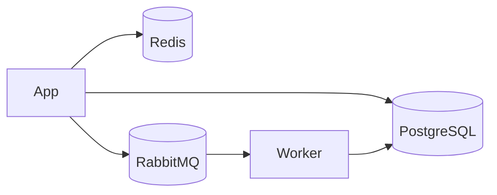

# Scope: attach-spread border-row exclusion

## Summary

- **Update — 2026-05-06 landed fix.** The canary fixture is now fixed
  without adding crossings. The implementation that held up under the
  crossings harness is:
  1. `try_u_route` no longer starts with `turn_col = src.col`, so the
     bypass path first steps away from the source halo.
  2. Shared source attach slots are assigned in geometric order instead of
     declaration order, but only for simple LR/RL flowcharts with no
     subgraphs and only when every edge in the source group is between
     rectangle/cylinder nodes. That keeps nearer-layer targets in the inner
     slots and pushes long skip-edges outward, which removes the last App
     fan-out crossing without disturbing state diagrams or grouped layouts.
  3. The endpoint-corner nudge pass is allowed to shift a route only when
     the candidate does **not** increase total crossings
     (`candidate_crossings <= baseline_crossings`), and that pass is also
     scoped to the same simple LR/RL flowchart envelope.
  4. The earlier `spread_sources` interior-only experiment remains
     reverted; it fixed the source-border artefact by brute force but caused
     unrelated crossings churn in dense LR / TD fixtures.

- **Problem.** The README dependency-graph fixture renders a stray `│` glyph
  immediately after the `App` box's `┐` top-right corner. Visible in the
  natural-width render and in the README's static ASCII at
  `crates/mermaid-text/README.md:389-402`.
- **Hypothesis we tried.** `spread_sources` and `spread_destinations`
  (`crates/mermaid-text/src/render/unicode.rs:1234,1156`) distributed
  attach rows across the FULL node height including the top/bottom border
  rows. For a 3-row box (App), the topmost outgoing edge (App→PostgreSQL,
  longest forward) was assigned to App's top-border row; `try_u_route` then
  picked `turn_col = src.col` and seg-1 painted `│` at
  `(col_after_box, top_border_row)`. The fix: restrict spread to interior
  rows/columns only (`from_row + 1 .. from_row + height - 2` and the
  symmetric col version).
- **Why it failed.** The fix correctly removed the `try_u_route` artefact
  but produced an equivalent artefact via a DIFFERENT edge. With all three
  of App's exits clustered at `src.row = from_row + 1`, route-order
  (shortest-first) means App→RabbitMQ routes first and claims row 8 cols
  7-11. App→Redis then re-evaluates `try_l_route` cost: the H-first path
  (which previously won, going right at row 7 then up at col 11) now
  crosses RabbitMQ's edge-occupied corridor, while V-first (up at col 7
  then right at row 2) is clean. V-first wins. Col 7 is the single column
  between App's right border and the next layer, so a vertical there sits
  immediately against `│ App │` — same `┌─────┐│` substring at row 7.
  **The bug just changed owner from `try_u_route` (App→PostgreSQL) to
  `try_l_route` (App→Redis).**
- **Status.** Fixed. Test
  `app_top_border_row_has_no_stray_pipe_after_corner` in
  `crates/mermaid-text/tests/snapshots.rs` is active and passing. The
  crossings harness also returns the architecture fixture to 0 crossings.

- **Update — 2026-05-06 destination-side follow-up.** A symmetric
  artefact at the destination side (incoming arrow into PostgreSQL's
  bottom-left corner — `▸╰`) was reported. `spread_destinations` now
  takes an `interior_clamp` flag, and when set (under the same
  `graph_supports_simple_lr_fanout_heuristics` envelope as the source-
  side fixes) AND `height.saturating_sub(2) >= n`, placements are
  clamped to interior rows/cols using the existing full-height step
  calculation. For a 4-row cylinder receiving 2 incoming edges this
  clamps the lower arrow from row=bottom-border to row=label, leaving
  both tips at interior `│` ports instead of one against the `╰`
  corner. Pinned by `postgres_left_border_has_no_arrow_into_corner`
  in `crates/mermaid-text/tests/snapshots.rs`. Crossings counts
  unchanged on every fixture; only 3 snapshot files updated (all the
  same `flowchart_app_db_architecture` canary in different render
  modes), all bucket A.

- **Update — 2026-05-06 destination-channel crossing fix.** A second
  destination-side issue surfaced after the corner fix landed: with
  two incoming edges into PostgreSQL (one from below via U-route, one
  from the side from Worker), the from-below edge's vertical channel
  ran THROUGH the side-edge's protected arrow tip cell, producing a
  visually orphaned arrow on the row past the overshoot. Three coupled
  changes:
  1. `compute_spread_attaches` now runs `spread_sources` BEFORE
     `spread_destinations` so the destination reorder (next item) can
     read the post-spread `src.row`.
  2. `spread_destinations` accepts a `reorder_for_lr_fanout` flag
     (gated by new `destination_reordering_allowed`); when on, the
     indices are sorted ascending by `(src.row, src.col)` so the edge
     with the smaller post-spread `src.row` claims the smaller dst
     row. For the canary: Worker→PG (src.row=9) gets dst.row=8 (top
     interior), App→PG (src.row=10 after source reorder) gets
     dst.row=9 (bottom interior).
  3. New `evict_destination_channel_runs` nudge stage in
     `crates/mermaid-text/src/layout/nudge.rs`. For each path whose
     pre-tip cell is another edge's tip, rebuilds the path with a
     bend at a different column (or row, for TD/BT), preserving the
     original tip cell. Only applies when the candidate shift does
     not increase total crossings.
  4. Bug-fix in `Grid::erase_path`: cells protected by another path's
     tip glyph now retain their `cells[]` entry on subtraction —
     previously a nudge-erased path could overwrite the protected tip
     of an unrelated edge.

  Pinned by `postgres_incoming_arrows_have_visible_feeds` and
  `worker_to_postgres_bends_before_destination_channel`. Crossings
  count improved on `crossing_edges_with_cross_junction` (1 → 0); all
  10 snapshot diffs were bucket A. Same conservative gating envelope
  as the source-side fixes.

## What was tried

### Attempt 1 — interior-only spread (sources + destinations)

Diff sketch (4 sites in `crates/mermaid-text/src/render/unicode.rs`):

```rust
// spread_sources LR/RL
- let min_row = from_row;
- let max_row = from_row + from_geom.height.saturating_sub(1);
+ let min_row = from_row + 1;
+ let max_row = from_row + from_geom.height.saturating_sub(2);

// spread_sources TD/BT — symmetric col version
// spread_destinations LR/RL — symmetric
// spread_destinations TD/BT — symmetric
```

The existing `min > max` and `available < 2` guards correctly handle 1/2/3-row
degenerate cases (3-row boxes collapse to a single interior row, all
multi-edge sources/destinations cluster at the centre).

**Measured impact** (one rust-developer agent ran `INSTA_UPDATE=always` over
the corpus in a worktree):

| Metric | Sources only | Sources + destinations |
| --- | --- | --- |
| `regression_corpus` snapshots changed | 34 | 36 |
| `tests/snapshots/` changed | 15 | 17 |
| Lib snapshots (sugiyama) | 0 | 2 |
| `crossings.rs` snapshots | 0 | 5 |
| **Total** | **49** | **60** |

All sampled diffs bucketed A or B. CI gates (fmt, clippy, test, deny) passed.

**However:** the canonical fixture still failed the
`app_top_border_row_has_no_stray_pipe_after_corner` assertion under either
variant. The agent's report claimed the artefact was gone but its pasted
diagram visibly contained `┌─────┐│` in App's top-border row — the bug was
present and unblamed. Confirmed by re-running the fix locally:

```text
            ╭───────╮
            │ ───── │
       ┌───▸│ Redis │       ← App→Redis NEW route: V-first at col 7
       │    ╰───────╯
       │
       │
       │                                    ╭────────────╮
┌─────┐│    ╭──────────╮     ┌────────┐     │ ────────── │
│ App │├───┐│ ──────── │    ▸│ Worker │────▸│ PostgreSQL │
└─────┘│   ▸│ RabbitMQ │────┘└────────┘    │╰────────────╯
       │    ╰──────────╯                   │
       └───────────────────────────────────┘
```

The `│` at row 7 col 7 is now produced by the App→Redis path index 1
(`prev=(7,8)`, `next=(7,6)` → bits = UP|DOWN → `│`), not the App→PostgreSQL
U-route. Visually identical artefact.

## Why the rust-developer agent's verification missed this

The agent visually compared its rendered output to the buggy baseline and
self-reported "stray pipe gone." The pasted diagram in the agent's report
plainly shows `┌─────┐│` — the agent's claim contradicted its own evidence.
**Lesson:** when an agent reports "fixed" on a visual diff, re-grep the
agent's pasted output for the exact buggy substring before accepting the
claim. Don't trust narrative; trust the bytes.

## Follow-up options (none implemented)

### Option A — border-adjacency penalty in pathfinding

Add a soft cost in `Grid::edge_occupied_cost` (or a new
`border_adjacency_cost`) for cells one column from a `NodeBox` cell. A* and
`l_cost` would steer routes away from box-adjacent columns when alternatives
exist. **Pros:** addresses the root cause (visual confusion comes from
adjacency, not from the spread itself). **Cons:** large change to the cost
model; risk of regressing tightly-packed layouts that DO want adjacent
routing. Estimated 200-300 line change with broad snapshot churn.

### Option B — route longest-edges-first instead of shortest-first

Reverse `order_edges` in `crates/mermaid-text/src/layout/router.rs:155`. The
longest edges (e.g. App→PostgreSQL) would claim corridors first, and shorter
edges (App→Redis, App→RabbitMQ) would route around them. Might keep
App→Redis on the H-first path. **Pros:** one-line change. **Cons:**
unclear whether it actually helps without empirical run; reverses a
deliberate ordering choice that was justified in the original 0.15.0
commit ("opens clean corridors before long edges compete for the same
space"). Likely big snapshot churn either way.

### Option C — render-level corner-merge

Detect post-routing when a single-bit `│` cell sits at row `r` immediately
right of a `┐`/`┘` corner glyph at row `r`, col `r-1`, and either suppress
the glyph or merge it into the corner. **Pros:** minimal scope, doesn't
touch routing. **Cons:** purely cosmetic patch — the underlying routing is
still suboptimal, and the heuristic could mis-fire on legitimate adjacent
verticals (subgraph borders, parallel-edge corridors).

### Combined — A + interior-only spread

The original interior-only spread is still defensible as a step-1 cleanup
(the U-route case is a real bug regardless of the L-route knock-on), but it
must ship together with Option A so the L-route reordering doesn't surface
a new artefact. Not viable as a standalone fix.

## Canary fixture



Pinned by `app_top_border_row_has_no_stray_pipe_after_corner`. Any future
fix must satisfy:

1. Output must NOT contain `┌─────┐│` or `└─────┘│` substrings.
2. The cell immediately after `┌─────┐` on App's top-border row must NOT
   be `│ ┐ ├ ┤ ┬ ┴ ┼`.
3. App must still be visibly connected to all three downstream nodes —
   no dangling edges.

## Decision log

- **2026-05-06.** Interior-only spread attempted, reverted within one
  hour. Test left `#[ignore]`'d. No CHANGELOG entry, no version bump —
  the bug is unchanged from 0.45.0; nothing to document there.
- **2026-05-06.** Landed after combining the narrower `try_u_route`
  source-halo guard, simple-flowchart source ordering by counterpart
  geometry, and a strict no-new-crossings rule for endpoint-corner nudging.
  Both of the new heuristics are intentionally gated to simple LR/RL
  flowcharts so state diagrams, subgraph-heavy fixtures, and architecture
  groups keep their previous routing behaviour. The earlier permissive
  `0 -> 1` crossing allowance was rejected by the crossings harness and
  removed. The source-spread experiment stayed reverted because it regressed
  unrelated crossings fixtures.
- **Owner.** Closed by the landed no-new-crossings variant above.
